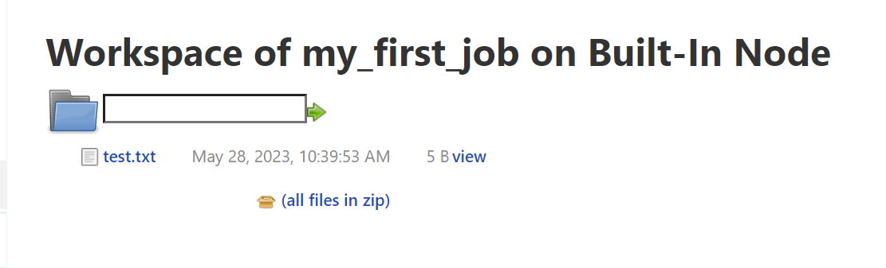
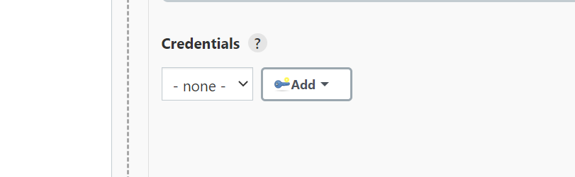

# Devops_Training

### Installing Jenkins and creating a CI/CD Pipeline 
- Setting up Jenkins using Docker 
- 


Jenkins is an open source automation server which enables you to reliably build, test, and deploy your software. It is one of the most sought over skills for a DevOps Engineer to have.  There are many other 'newer' CI/CD solutions like CircleCI and Github Actions but Jenkins still has the largest footprint in the CI/CD space.  Knowing how to setup and manage a Jenkins Infrastructure as well as how to setup and troubleshoot Freestyle builds and Groovy Pipelines is something you that will help someone grow their Career as an Engineer. 

In a nutshell Jenkins is a way for developers to auntomate the work they don't want to do to make business saving many and allocate resources to more pressing needs.


1. Firstly we will set up a Docker Container in order to run Jenkins in a Container environment as this is one of the suggested methods of doing this.

In order to build our Docker Image we will be doing this via Visual Studio Code we must first make sure we have docker and dev containers extension installed


 


After doing this we can then clone our repo using `git clone "repo HTTPS"` 
We do this so we can create our docker image here
We will be using BlueOcean which is a add on for Jenkins, makes our CI/CD look nicer and easier to manage and troubleshoot. 

we then excute `docker build -t myjenkins-blueocean:2.332.3-1 .` in order to start building our docker container, it goes out a grabs the docker image of Jenkins is what our command is doing.

then we create our Jenkins network using the following `docker network create jenkins`

then we excute `docker network ls` to confirm we have the jenkins network.

then we run 

   ```ruby
docker run --name jenkins-blueocean --restart=on-failure --detach `
  --network jenkins --env DOCKER_HOST=tcp://docker:2376 `
  --env DOCKER_CERT_PATH=/certs/client --env DOCKER_TLS_VERIFY=1 `
  --volume jenkins-data:/var/jenkins_home `
  --volume jenkins-docker-certs:/certs/client:ro `
  --publish 8080:8080 --publish 50000:50000 myjenkins-blueocean:2.332.3-1
  
  ```

this will start our container
then `docker ps` this will give us info and show us our docker image continer is listening on port "8080" 

then we enter The link provided, "http://127.0.0.1:8080/", this is a local network address that refers to the loopback interface on our computer. It is commonly used to access resources on the same machine where the request originated.


password cant be typical found in `/var/jenkins_home/secrets/initialAdminPassword`  but since we are running this on a docker container we will use the docker exact command to cat out the file,


"Catting out a file" typically refers to the act of displaying the contents of a file on a computer terminal or command line interface using the "cat" command. The "cat" command is short for "concatenate" and is commonly available on Unix-like operating systems.

When you "cat out" a file, the contents of the file are printed out directly to the terminal or command line window. This can be useful for quickly viewing the contents of a text file or for combining the contents of multiple files into a single output.

we use the following command `docker exec jenkins-blueocean cat /var/jenkins_home/secrets/initialAdminPassword`

then we enter the password provided, and just follow through the webpage selecting default settings.


`http://127.0.0.1:8080/` we use this link to access our jenkins server


After we should have access to our server.


Now we need to set up some agents as running pipelines in our master is not recommended.


Furthermore we will be using plug-ins very often as this is one of the key reasons Jenkins is highly used.


Next we will have a look at the different enveronment variable, in order to make our bash script more complicated and able to carry out bore tasks for our builds. Variables are something we use often.


We will be using the build ID so we know which build, built our image.


and here we can see our build was a success.


now we will use `ls -ltr` in the command column this will show all the file in the current the work space. The command will be sent to Linux.

We will also need to create a file as this command will do nothing if we haven't got any files.


 ```ruby
ls -ltr

echo "1234" > test.txt

ls - ltr 
 ```

so here `echo 1234` is the output and `>` is send the output to a file we create called `test.txt`

Furthermore if we click on work space we will be able to see our file that we created.




next we will try the following:


command to get in to docker terminal we will use these commands in our terminal.

`docker exec -it jenkins-blueocean bash` 

next we go in to `cd var/jenkins_home/`

next we use `ls -ltra`

a lot of files will show up but we are interested in workspace

next we cd in to workspace `cd workspace`

next we use `ls -ltra` and we will see our folder.


## New Python Script Job:
Now we will create a new job and clone a repository and run a python script.    


As this is a public repo we are using we won't need and credentials. If it was private we would need credentials.   



we then want to execute a shell.
we will enter our script here:
`python3 helloworld.py`


We can see it went to our repo cloned everything and run python3 helloworld and run our script and the output.

Although simple this is very it is very powerful instead of logging into a server run a python script and SSH to a server we can just run a Jenkins script press build and we know it runs.

We can also run this job with triggers or a web hook whenever a repository is updated and we will always get a history of when our script was run.


Now we have the basic of making builds in Jenkins we can do some more complicated stuff like creating agents in the future.

